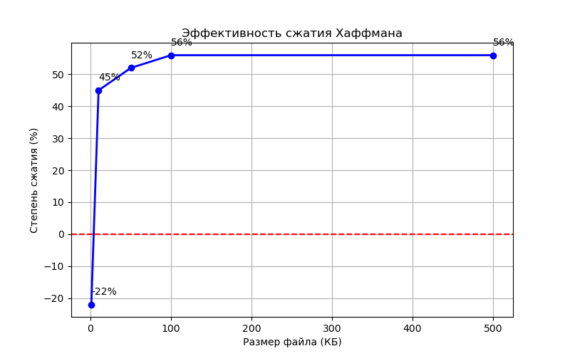

# Архиватор на базе алгоритма Хаффмана
[](https://github.com/altrum06/huffman-arhive/actions/workflows/ci.yml)
[](https://github.com/altrum06/huffman-arhive/actions/workflows/lint.yml)
[](https://opensource.org/licenses/MIT)


Консольное приложение на языке C для сжатия и восстановления файлов без потерь. Поддерживает любые типы файлов: текст, изображения, документы и другие бинарные данные.

## Алгоритм

В основе программы лежит **алгоритм Хаффмана** - метод сжатия без потерь, который строит оптимальные префиксные коды. Идея проста: частые символы кодируются короткими битовыми последовательностями, а редкие -  длинными. Это позволяет эффективно уменьшать размер файла, особенно в данных с неравномерным распределением символов.

## Структура проекта
```bash
huffman-arhive/
│
├── .github/
│   └── workflows/
│       ├── lint.yml
│       └── ci.yml                 # GitHub Actions CI
│
├── src/
│   ├── archive/
│   │   ├── compressor.c
│   │   └── compressor.h
│   ├── bits/
│   │   ├── bit_io.c
│   │   └── bit_io.h
│   ├── queue/
│   │   ├── priority_queue.c
│   │   └── priority_queue.h
│   └── tree/
│       ├── huffman_tree.c
│       └── huffman_tree.h
│
├── src_main/
│   └── main.c                      # Точка входа
│
├── tests/
│   ├── test_archive.c
│   ├── test_bits.c
│   ├── test_codes.c
│   ├── test_queue.c
│   ├── test_tree.c
│   └── run_all_tests.c
│
├── experiments/
│   ├── experiment.c
│   ├── experiment.h
│   ├── analyze_results.py
│   └── run_experiments.sh
│   
│
├── data/
│   ├── input/
│   │   ├── binary/
│   │   ├── mixed/
│   │   └── text/
│   └── output/
│       ├── compressed/
│       └── decompressed/
│
├── docs/
│   ├── graph.png
│   └── results.txt
│
├── CMakeLists.txt
├── README.md
├── LICENSE
├── .gitignore
└── Makefile
```


```bash
## Требования

* **CMake** (версия 3.10 или выше)
* **C-компилятор** с поддержкой стандарта C99 (например, `gcc` или `clang`)

## Сборка

Инструкция для сборки проекта из командной строки:


# 1. Клонируйте репозиторий
git clone https://github.com/altrum06/huffman-arhive.git
cd huffman-arhive

# 2. Создайте папку для сборки и перейдите в неё
mkdir build && cd build

# 3. Сгенерируйте Makefile через CMake
cmake ..

# 4. Выполните сборку
make
```
Использование

Запуск программы для сжатия или распаковки файла:
```bash
# Сжатие
./build/huffman_app -c <входной_файл> <выходной_архив>

# Распаковка
./build/huffman_app -d <входной_архив> <выходной_файл>

# Вывод справки
./build/huffman_app -h
```
Запуск тестов:
```bash
./build/run_tests
```
Ожидаемый вывод:
```bash
 ТЕСТЫ АРХИВАТОРА
  Простой текст
  Один символ
  Повторяющиеся символы
  Обработка ошибок
  Русский текст

Все тесты прошли
```

## Эксперименты

Запуск экспериментов:

```bash
cd experiments
./run_experiments.sh
```


## Результаты


### Зависимость от размера файла (текстовый файл)

| Размер | Исходный размер | Сжатый размер | Степень сжатия |
|--------|-----------------|---------------|----------------|
| 1 KB | 1,024 B | ~1.2 KB | **-22%** |
| 10 KB | 10,240 B | ~5.6 KB | **45%** |
| 50 KB | 51,200 B | ~24.6 KB | **52%** |
| 100 KB | 102,400 B | ~45.1 KB | **56%** |
| 500 KB | 512,000 B | ~225.3 KB | **56%** |

> **Вывод:** Алгоритм эффективен для файлов размером **более 10 КБ**. На маленьких файлах (1-2 КБ) размер может увеличиваться из-за расходов на заголовок дерева частот

---

### Зависимость от типа данных (файлы размером 100 KB)

| Тип данных | Описание | Исходный | Сжатый | Степень сжатия |
|------------|----------|----------|--------|----------------|
| **Текст** | Случайные буквы A-Z | 100 KB | 48 KB | **52%** |
| **Повторяющиеся символы** | 100,000 символов 'A' | 100 KB | 2 KB | **98%** |
| **Случайные байты** | Бинарный файл со случайными значениями | 100 KB | 98 KB | **2%** |

> **Вывод:** Алгоритм Хаффмана **отлично** сжимает данные с повторяющейся структурой и **бесполезен** для случайных  данных

---

### Зависимость от размера (на графике)



---

### Сравнение скорости сжатия и распаковки (файл 100 KB)

| Операция | Время |
|----------|-------|
| Сжатие | ~0.015 сек |
| Распаковка | ~0.008 сек |

> **Вывод:** Распаковка выполняется **в 1.5-2 раза быстрее** сжатия, так как не требует построения дерева частот.

---

### Общие выводы по результатам экспериментов

1. **Порог эффективности:** Алгоритм начинает эффективно сжимать файлы начиная с **10-50 КБ**
2. **Лучшее сжатие:** Данные с повторяющимися символами сжимаются почти полностью **(до 98%)**
3. **Худшее сжатие:** Случайные и уже сжатые данные (JPG, MP3, ZIP) практически **не сжимаются**
4. **Скорость:** Распаковка значительно быстрее сжатия
5. **Накладные расходы:** Для файлов менее 2-3 КБ размер может **увеличиться** из-за сохранения дерева частот
